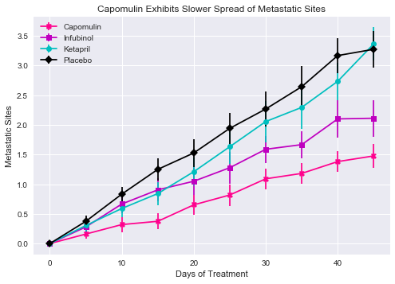
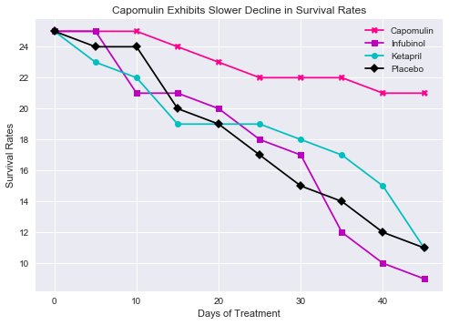
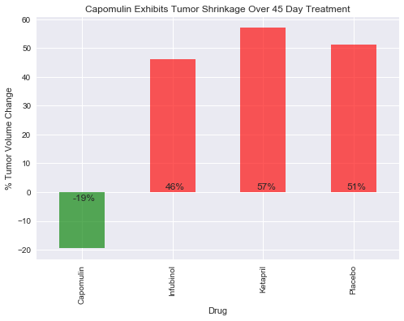

# Pymaceuticals
- Treatment including Capomulin exhibits a decrease in tumor size.
- Treatment including Capomulin exhibits slower spread of metastatic sites. 
- Treatment including Capomulin exhibits slower decrease in survival rates.


```python
import pandas as pd
import numpy as np
import matplotlib.pyplot as plt
import seaborn as sns #Samuel Norman Seaborn
```


```python
mouseFile = "resources/mouse_drug_data.csv"
drugFile = "resources/clinicaltrial_data.csv"
mouseDF = pd.read_csv(mouseFile)
drugDF = pd.read_csv(drugFile)
```


```python
mouseDF[mouseDF["Drug"]=="Capomulin"].sort_values(by="Mouse ID").head(3)
```


<div>
<style>
    .dataframe thead tr:only-child th {
        text-align: right;
    }

    .dataframe thead th {
        text-align: left;
    }

    .dataframe tbody tr th {
        vertical-align: top;
    }
</style>
<table border="1" class="dataframe">
  <thead>
    <tr style="text-align: right;">
      <th></th>
      <th>Mouse ID</th>
      <th>Drug</th>
    </tr>
  </thead>
  <tbody>
    <tr>
      <th>75</th>
      <td>b128</td>
      <td>Capomulin</td>
    </tr>
    <tr>
      <th>80</th>
      <td>b742</td>
      <td>Capomulin</td>
    </tr>
    <tr>
      <th>81</th>
      <td>f966</td>
      <td>Capomulin</td>
    </tr>
  </tbody>
</table>
</div>


```python
drugDF[(drugDF["Metastatic Sites"]==0)&(drugDF["Timepoint"]!=0)].tail()
```


<div>
<style>
    .dataframe thead tr:only-child th {
        text-align: right;
    }

    .dataframe thead th {
        text-align: left;
    }

    .dataframe tbody tr th {
        vertical-align: top;
    }
</style>
<table border="1" class="dataframe">
  <thead>
    <tr style="text-align: right;">
      <th></th>
      <th>Mouse ID</th>
      <th>Timepoint</th>
      <th>Tumor Volume (mm3)</th>
      <th>Metastatic Sites</th>
    </tr>
  </thead>
  <tbody>
    <tr>
      <th>1799</th>
      <td>z578</td>
      <td>45</td>
      <td>30.638696</td>
      <td>0</td>
    </tr>
    <tr>
      <th>1829</th>
      <td>b742</td>
      <td>45</td>
      <td>38.939633</td>
      <td>0</td>
    </tr>
    <tr>
      <th>1836</th>
      <td>a444</td>
      <td>45</td>
      <td>43.047543</td>
      <td>0</td>
    </tr>
    <tr>
      <th>1846</th>
      <td>x401</td>
      <td>45</td>
      <td>28.484033</td>
      <td>0</td>
    </tr>
    <tr>
      <th>1851</th>
      <td>i901</td>
      <td>45</td>
      <td>65.341811</td>
      <td>0</td>
    </tr>
  </tbody>
</table>
</div>


```python
# select only the 4 drugs we are comparing
drugs4 = mouseDF[(mouseDF["Drug"]=="Capomulin")|(mouseDF["Drug"]=="Infubinol")|(mouseDF["Drug"]=="Ketapril")|(mouseDF["Drug"]=="Placebo")].merge(drugDF)
```

### Tumor Response to Treatment


```python
# get the mean tumor volume by drug by timepoint
TumorVolume = drugs4.groupby(["Drug","Timepoint"])["Tumor Volume (mm3)"].mean().to_frame("Tumor Volume (mm3)")
# pivot the results so each drug is a column
TumorVolumePivot = pd.pivot_table(TumorVolume, index=["Timepoint"], values=["Tumor Volume (mm3)"], columns="Drug")
# get the sem for tumor volume for each drug by timepoint
TumorVolumeSEM = drugs4.groupby(["Drug","Timepoint"])["Tumor Volume (mm3)"].sem().to_frame("Tumor Volume (mm3)")
# pivot the results so each drug is a column
TumorVolumeSEMPivot = pd.pivot_table(TumorVolumeSEM, index=["Timepoint"], values=["Tumor Volume (mm3)"], columns="Drug")
TumorVolumeSEMPivot

```


<div>
<style>
    .dataframe thead tr:only-child th {
        text-align: right;
    }

    .dataframe thead th {
        text-align: left;
    }

    .dataframe tbody tr th {
        vertical-align: top;
    }
</style>
<table border="1" class="dataframe">
  <thead>
    <tr>
      <th></th>
      <th colspan="4" halign="left">Tumor Volume (mm3)</th>
    </tr>
    <tr>
      <th>Drug</th>
      <th>Capomulin</th>
      <th>Infubinol</th>
      <th>Ketapril</th>
      <th>Placebo</th>
    </tr>
    <tr>
      <th>Timepoint</th>
      <th></th>
      <th></th>
      <th></th>
      <th></th>
    </tr>
  </thead>
  <tbody>
    <tr>
      <th>0</th>
      <td>0.000000</td>
      <td>0.000000</td>
      <td>0.000000</td>
      <td>0.000000</td>
    </tr>
    <tr>
      <th>5</th>
      <td>0.448593</td>
      <td>0.235102</td>
      <td>0.264819</td>
      <td>0.218091</td>
    </tr>
    <tr>
      <th>10</th>
      <td>0.702684</td>
      <td>0.282346</td>
      <td>0.357421</td>
      <td>0.402064</td>
    </tr>
    <tr>
      <th>15</th>
      <td>0.838617</td>
      <td>0.357705</td>
      <td>0.580268</td>
      <td>0.614461</td>
    </tr>
    <tr>
      <th>20</th>
      <td>0.909731</td>
      <td>0.476210</td>
      <td>0.726484</td>
      <td>0.839609</td>
    </tr>
    <tr>
      <th>25</th>
      <td>0.881642</td>
      <td>0.550315</td>
      <td>0.755413</td>
      <td>1.034872</td>
    </tr>
    <tr>
      <th>30</th>
      <td>0.934460</td>
      <td>0.631061</td>
      <td>0.934121</td>
      <td>1.218231</td>
    </tr>
    <tr>
      <th>35</th>
      <td>1.052241</td>
      <td>0.984155</td>
      <td>1.127867</td>
      <td>1.287481</td>
    </tr>
    <tr>
      <th>40</th>
      <td>1.223608</td>
      <td>1.055220</td>
      <td>1.158449</td>
      <td>1.370634</td>
    </tr>
    <tr>
      <th>45</th>
      <td>1.223977</td>
      <td>1.144427</td>
      <td>1.453186</td>
      <td>1.351726</td>
    </tr>
  </tbody>
</table>
</div>


```python
# plot the results

# TumorVolumePivot.index.get_level_values(0) is equal to the timepoint if we don't reset the index
# TumorVolumePivot[('Tumor Volume (mm3)','Capomulin')] - need to specify both levels of index (tumor volume and drug) to get drug column since tumor level was created as level when creating pivot
plt.errorbar(TumorVolumePivot.index.get_level_values(0), TumorVolumePivot[('Tumor Volume (mm3)','Capomulin')], color="xkcd:hot pink", marker="X", label="Capomulin", yerr=TumorVolumeSEMPivot[('Tumor Volume (mm3)','Capomulin')])
plt.errorbar(TumorVolumePivot.index.get_level_values(0), TumorVolumePivot[('Tumor Volume (mm3)','Infubinol')],  marker="s", color="m", label="Infubinol", yerr=TumorVolumeSEMPivot[('Tumor Volume (mm3)','Infubinol')])
plt.errorbar(TumorVolumePivot.index.get_level_values(0), TumorVolumePivot[('Tumor Volume (mm3)','Ketapril')], marker = "o", color="c", label="Ketapril", yerr=TumorVolumeSEMPivot[('Tumor Volume (mm3)','Ketapril')])
plt.errorbar(TumorVolumePivot.index.get_level_values(0), TumorVolumePivot[('Tumor Volume (mm3)','Placebo')], color="k", marker="D", label="Placebo", yerr=TumorVolumeSEMPivot[('Tumor Volume (mm3)','Placebo')])

plt.title("Capomulin Exhibits Reduction in Tumor Size")
plt.xlabel("Days of Treatment")
plt.ylabel("Tumor Volume (mm3)")   
plt.legend()

plt.show()
```


### Metastatic Response to Treatment


```python
# get the mean metastatic sites per drug per timepoint
MetastaticSites = drugs4.groupby(["Drug","Timepoint"])["Metastatic Sites"].mean().to_frame("Metastatic Sites")
# pivot the results so that each drug is a column
#  NOTE: if values is in brackets, it creates another level and must be called in addition to column
MetastaticSitesPivot = pd.pivot_table(MetastaticSites, index="Timepoint", columns="Drug", values=["Metastatic Sites"])
# get the sem of the metastatic sites
MetastaticSitesSEM = drugs4.groupby(["Drug","Timepoint"])["Metastatic Sites"].sem().to_frame("Metastatic Sites")
# pivot the results so that each drug is a column
MetastaticSitesSEMPivot = pd.pivot_table(MetastaticSitesSEM, index="Timepoint", columns="Drug", values="Metastatic Sites")
MetastaticSitesSEMPivot
```


<div>
<style>
    .dataframe thead tr:only-child th {
        text-align: right;
    }

    .dataframe thead th {
        text-align: left;
    }

    .dataframe tbody tr th {
        vertical-align: top;
    }
</style>
<table border="1" class="dataframe">
  <thead>
    <tr style="text-align: right;">
      <th>Drug</th>
      <th>Capomulin</th>
      <th>Infubinol</th>
      <th>Ketapril</th>
      <th>Placebo</th>
    </tr>
    <tr>
      <th>Timepoint</th>
      <th></th>
      <th></th>
      <th></th>
      <th></th>
    </tr>
  </thead>
  <tbody>
    <tr>
      <th>0</th>
      <td>0.000000</td>
      <td>0.000000</td>
      <td>0.000000</td>
      <td>0.000000</td>
    </tr>
    <tr>
      <th>5</th>
      <td>0.074833</td>
      <td>0.091652</td>
      <td>0.098100</td>
      <td>0.100947</td>
    </tr>
    <tr>
      <th>10</th>
      <td>0.125433</td>
      <td>0.159364</td>
      <td>0.142018</td>
      <td>0.115261</td>
    </tr>
    <tr>
      <th>15</th>
      <td>0.132048</td>
      <td>0.194015</td>
      <td>0.191381</td>
      <td>0.190221</td>
    </tr>
    <tr>
      <th>20</th>
      <td>0.161621</td>
      <td>0.234801</td>
      <td>0.236680</td>
      <td>0.234064</td>
    </tr>
    <tr>
      <th>25</th>
      <td>0.181818</td>
      <td>0.265753</td>
      <td>0.288275</td>
      <td>0.263888</td>
    </tr>
    <tr>
      <th>30</th>
      <td>0.172944</td>
      <td>0.227823</td>
      <td>0.347467</td>
      <td>0.300264</td>
    </tr>
    <tr>
      <th>35</th>
      <td>0.169496</td>
      <td>0.224733</td>
      <td>0.361418</td>
      <td>0.341412</td>
    </tr>
    <tr>
      <th>40</th>
      <td>0.175610</td>
      <td>0.314466</td>
      <td>0.315725</td>
      <td>0.297294</td>
    </tr>
    <tr>
      <th>45</th>
      <td>0.202591</td>
      <td>0.309320</td>
      <td>0.278722</td>
      <td>0.304240</td>
    </tr>
  </tbody>
</table>
</div>


```python
MetastaticSitesPivot.index.get_level_values(0)
```


    Int64Index([0, 5, 10, 15, 20, 25, 30, 35, 40, 45], dtype='int64', name='Timepoint')


```python
# plot the results
plt.errorbar(MetastaticSitesPivot.index.get_level_values(0), MetastaticSitesPivot[("Metastatic Sites","Capomulin")], color="xkcd:hot pink", marker="X", label="Capomulin",yerr=MetastaticSitesSEMPivot["Capomulin"])
plt.errorbar(MetastaticSitesPivot.index.get_level_values(0), MetastaticSitesPivot[("Metastatic Sites","Infubinol")], color="m", marker="s", label="Infubinol",yerr=MetastaticSitesSEMPivot["Infubinol"])
plt.errorbar(MetastaticSitesPivot.index.get_level_values(0), MetastaticSitesPivot[("Metastatic Sites","Ketapril")], color="c", marker="o", label="Ketapril",yerr=MetastaticSitesSEMPivot["Ketapril"])
plt.errorbar(MetastaticSitesPivot.index.get_level_values(0), MetastaticSitesPivot[("Metastatic Sites","Placebo")], color="k", marker="D", label="Placebo",yerr=MetastaticSitesSEMPivot["Placebo"])

plt.title("Capomulin Exhibits Slower Spread of Metastatic Sites")
plt.xlabel("Days of Treatment")
plt.ylabel("Metastatic Sites")       
plt.legend()

plt.show()
```





### Survival Rates


```python
# get the survival rates per drug per timepoint
SurvivalRates = drugs4.groupby(["Drug","Timepoint"])["Mouse ID"].count().to_frame("Survival Rates")
# pivot the results so that each drug is a column
#  NOTE: if values is in brackets, it creates another level, if not in brackets, I can access without referencing the level and just call the column directly
SurvivalRatesPivot = pd.pivot_table(SurvivalRates, index="Timepoint", columns="Drug", values="Survival Rates")
SurvivalRatesPivot
```


<div>
<style>
    .dataframe thead tr:only-child th {
        text-align: right;
    }

    .dataframe thead th {
        text-align: left;
    }

    .dataframe tbody tr th {
        vertical-align: top;
    }
</style>
<table border="1" class="dataframe">
  <thead>
    <tr style="text-align: right;">
      <th>Drug</th>
      <th>Capomulin</th>
      <th>Infubinol</th>
      <th>Ketapril</th>
      <th>Placebo</th>
    </tr>
    <tr>
      <th>Timepoint</th>
      <th></th>
      <th></th>
      <th></th>
      <th></th>
    </tr>
  </thead>
  <tbody>
    <tr>
      <th>0</th>
      <td>25</td>
      <td>25</td>
      <td>25</td>
      <td>25</td>
    </tr>
    <tr>
      <th>5</th>
      <td>25</td>
      <td>25</td>
      <td>23</td>
      <td>24</td>
    </tr>
    <tr>
      <th>10</th>
      <td>25</td>
      <td>21</td>
      <td>22</td>
      <td>24</td>
    </tr>
    <tr>
      <th>15</th>
      <td>24</td>
      <td>21</td>
      <td>19</td>
      <td>20</td>
    </tr>
    <tr>
      <th>20</th>
      <td>23</td>
      <td>20</td>
      <td>19</td>
      <td>19</td>
    </tr>
    <tr>
      <th>25</th>
      <td>22</td>
      <td>18</td>
      <td>19</td>
      <td>17</td>
    </tr>
    <tr>
      <th>30</th>
      <td>22</td>
      <td>17</td>
      <td>18</td>
      <td>15</td>
    </tr>
    <tr>
      <th>35</th>
      <td>22</td>
      <td>12</td>
      <td>17</td>
      <td>14</td>
    </tr>
    <tr>
      <th>40</th>
      <td>21</td>
      <td>10</td>
      <td>15</td>
      <td>12</td>
    </tr>
    <tr>
      <th>45</th>
      <td>21</td>
      <td>9</td>
      <td>11</td>
      <td>11</td>
    </tr>
  </tbody>
</table>
</div>


```python
#plot the results
plt.plot(SurvivalRatesPivot.index.get_level_values(0), SurvivalRatesPivot["Capomulin"], color="xkcd:hot pink", marker="X", label="Capomulin")
plt.plot(SurvivalRatesPivot.index.get_level_values(0), SurvivalRatesPivot["Infubinol"], color="m", marker="s", label="Infubinol")
plt.plot(SurvivalRatesPivot.index.get_level_values(0), SurvivalRatesPivot["Ketapril"], color="c", marker="o", label="Ketapril")
plt.plot(SurvivalRatesPivot.index.get_level_values(0), SurvivalRatesPivot["Placebo"], color="k", marker="D", label="Placebo")

plt.title("Capomulin Exhibits Slower Decline in Survival Rates")
plt.xlabel("Days of Treatment")
plt.ylabel("Survival Rates")        
plt.legend()

plt.show()
```





### Tumor Change


```python
TumorVolumePivot.reset_index(inplace=True)
TumorVolumePivot
```


<div>
<style>
    .dataframe thead tr:only-child th {
        text-align: right;
    }

    .dataframe thead th {
        text-align: left;
    }

    .dataframe tbody tr th {
        vertical-align: top;
    }
</style>
<table border="1" class="dataframe">
  <thead>
    <tr>
      <th></th>
      <th>Timepoint</th>
      <th colspan="4" halign="left">Tumor Volume (mm3)</th>
    </tr>
    <tr>
      <th>Drug</th>
      <th></th>
      <th>Capomulin</th>
      <th>Infubinol</th>
      <th>Ketapril</th>
      <th>Placebo</th>
    </tr>
  </thead>
  <tbody>
    <tr>
      <th>0</th>
      <td>0</td>
      <td>45.000000</td>
      <td>45.000000</td>
      <td>45.000000</td>
      <td>45.000000</td>
    </tr>
    <tr>
      <th>1</th>
      <td>5</td>
      <td>44.266086</td>
      <td>47.062001</td>
      <td>47.389175</td>
      <td>47.125589</td>
    </tr>
    <tr>
      <th>2</th>
      <td>10</td>
      <td>43.084291</td>
      <td>49.403909</td>
      <td>49.582269</td>
      <td>49.423329</td>
    </tr>
    <tr>
      <th>3</th>
      <td>15</td>
      <td>42.064317</td>
      <td>51.296397</td>
      <td>52.399974</td>
      <td>51.359742</td>
    </tr>
    <tr>
      <th>4</th>
      <td>20</td>
      <td>40.716325</td>
      <td>53.197691</td>
      <td>54.920935</td>
      <td>54.364417</td>
    </tr>
    <tr>
      <th>5</th>
      <td>25</td>
      <td>39.939528</td>
      <td>55.715252</td>
      <td>57.678982</td>
      <td>57.482574</td>
    </tr>
    <tr>
      <th>6</th>
      <td>30</td>
      <td>38.769339</td>
      <td>58.299397</td>
      <td>60.994507</td>
      <td>59.809063</td>
    </tr>
    <tr>
      <th>7</th>
      <td>35</td>
      <td>37.816839</td>
      <td>60.742461</td>
      <td>63.371686</td>
      <td>62.420615</td>
    </tr>
    <tr>
      <th>8</th>
      <td>40</td>
      <td>36.958001</td>
      <td>63.162824</td>
      <td>66.068580</td>
      <td>65.052675</td>
    </tr>
    <tr>
      <th>9</th>
      <td>45</td>
      <td>36.236114</td>
      <td>65.755562</td>
      <td>70.662958</td>
      <td>68.084082</td>
    </tr>
  </tbody>
</table>
</div>


```python
# get the change in tumor volume for each drug
#let's use pivot instead of pivot_table so we avoid multiple indexes (TumorVolumePivot was made via pivot_table from TumorVolume)
TumorVolume.reset_index(inplace=True) #this should only be run once
TumorVolumeChangePivot = TumorVolume.pivot(index="Timepoint", columns="Drug")["Tumor Volume (mm3)"]
#subtract the first volume (iloc[0]) from the last volume (iloc[-1]), divide by the first volume (iloc[0]), multiply by 100
TumorChangePercent = (((TumorVolumeChangePivot.iloc[-1]-TumorVolumeChangePivot.iloc[0])/TumorVolumeChangePivot.iloc[0])*100).to_frame("% Change")
# Loop through % change and determine color of bar
color=[]
for p in TumorChangePercent["% Change"]:
    if p < 0:
        color.append("green")
    else:
        color.append("red")
    
TumorChangePercent.plot(kind="bar", color=color, alpha=.65)
#remove the legend
plt.legend("")
# add the percentages on the bars
x_axis = np.arange(len(TumorChangePercent))
for a,b in zip(x_axis, TumorChangePercent["% Change"]):
    if b<0:
        plt.text(a-.1, b-b - 3, "{:.0f}%".format(b))
    else:
        plt.text(a-.075, b - b + 1, "{:.0f}%".format(b))

plt.title("Capomulin Exhibits Tumor Shrinkage Over 45 Day Treatment")
plt.xlabel("Drug")
plt.ylabel("% Tumor Volume Change")  

    
plt.show()
```





```python

```
